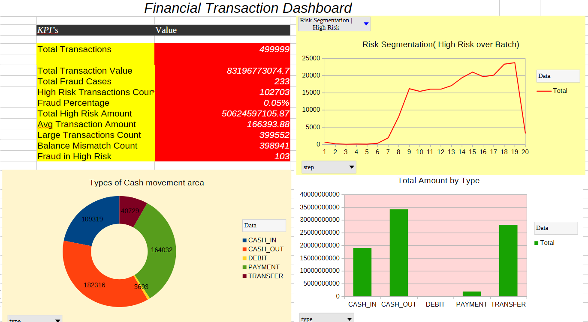
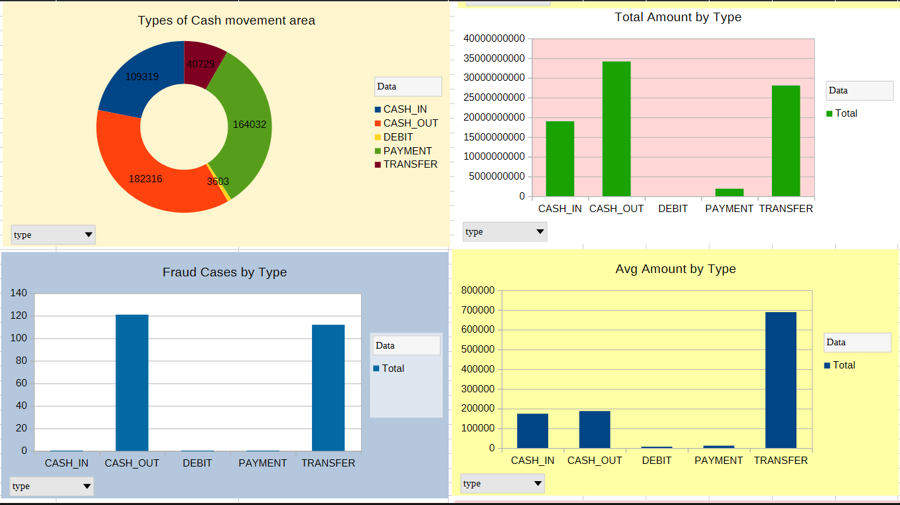
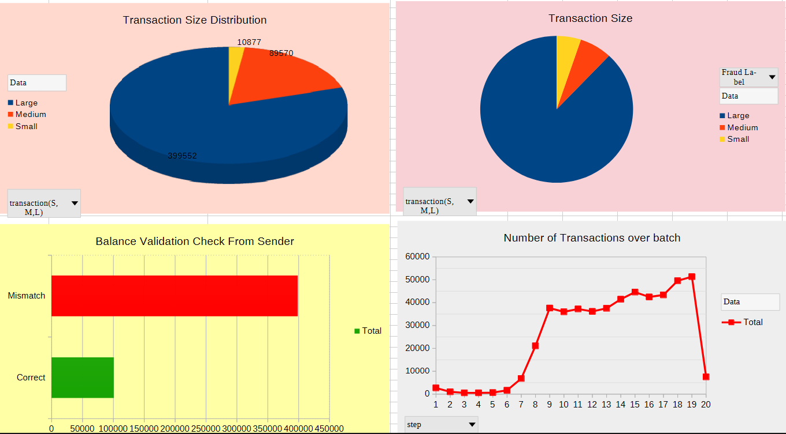

# 📊 Financial Fraud Analysis & Risk Dashboard

## 🚀 Overview

Analyzed **500,000+ financial transactions** to uncover fraud patterns, high-risk behaviors, and transaction trends.
Transformed raw, large-scale data into a **business-ready dashboard** using advanced spreadsheet analytics.

This project demonstrates the ability to **handle real-world data volumes, engineer meaningful features, and deliver actionable insights**.

---

## 🎯 Key Outcomes

* Identified fraud concentration in **TRANSFER and CASH_OUT transactions**
* Detected **high-risk financial movements** using rule-based logic
* Validated transaction integrity using balance reconciliation
* Built a **clean, interactive dashboard** for decision-making

---

## 🛠️ Tools & Skills

* LibreOffice Calc (Advanced)
* Data Cleaning & Preprocessing
* Feature Engineering
* Pivot Table Analysis
* KPI Design & Dashboarding
* Conditional Formatting

---

## 📂 Dataset Summary

* **Source**: [Kaggle - PaySim1 Financial Dataset](https://www.kaggle.com/datasets/ealaxi/paysim1)
* ~500,000 transaction records
* Multiple transaction types: CASH_IN, CASH_OUT, TRANSFER, PAYMENT, DEBIT
* Includes sender/receiver balances and fraud labels

---

## ⚙️ Data Preparation

* Cleaned inconsistent formats and validated numeric fields
* Removed anomalies and ensured data consistency
* Engineered new analytical features:

### 🔧 Created Columns

* Fraud Label (Fraud / Normal)
* Transaction Size (Small / Medium / Large)
* High Risk Indicator
* Balance Validation Check

---

## 📊 Key KPIs

* Total Transactions
* Total Transaction Value
* Fraud Count & Fraud %
* High Risk Transaction Count
* Average Transaction Amount

---

## 📈 Analysis & Insights

### 🔹 Transaction Behavior

* PAYMENT transactions dominate in volume
* TRANSFER and CASH_OUT dominate in value

### 🔹 Fraud Patterns

* Fraud is heavily concentrated in:

  * TRANSFER
  * CASH_OUT

### 🔹 Risk Analysis

* High-value transactions strongly correlate with risk
* Identified suspicious movement patterns across accounts

### 🔹 Data Validation

* Verified financial consistency:

  * `Old Balance - Amount = New Balance`
* Flagged mismatches for anomaly detection

---

## 📊 Dashboard Features

* KPI cards for quick insights
* Transaction distribution visualization
* Amount analysis by type
* Fraud and risk-focused charts
* Clean, structured layout for readability

---

## 🖼️ Dashboard Preview

### View 1

### View 2

### View 3

---

## 💡 Key Insights

* 🚨 Fraud primarily occurs in **TRANSFER and CASH_OUT**
* 💰 Large transactions contribute most financial value
* ⚠️ High-risk transactions are linked to large transfers
* 🔍 Balance inconsistencies highlight potential anomalies

---

## 🧠 What This Project Demonstrates

* Ability to analyze **large-scale datasets (500K+)**
* Strong understanding of **financial data behavior**
* Practical use of **data analysis techniques in spreadsheets**
* Capability to build **professional dashboards from raw data**

---

## 🚀 Future Improvements

* Move to **Python / SQL / Power BI** for scalability
* Implement **machine learning-based fraud detection**
* Real-time transaction monitoring system

---

## 👨‍💻 Author

**Steve Philip. S**
Aspiring Data Scientist/ AI Engineer

---

## ⭐ Support

If you found this project useful, consider giving it a ⭐ and sharing feedback!
